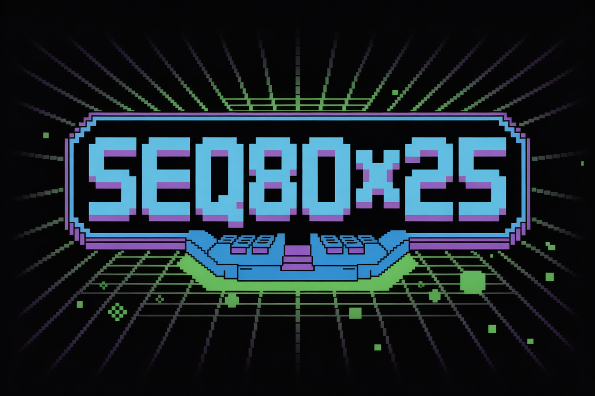

# Seq80x25

A retro-inspired, terminal-based music sequencer that brings the nostalgic charm of DOS-style interfaces to modern music creation. Built to run in an 80x25 terminal grid, Seq80x25 lets you compose chiptune-style music with a simple, text-based interface.



*Compose in Code: Retro Beats in 80x25 Glory!*

## Features

- **Retro UI**: 80x25 terminal grid with ASCII-based visuals, mimicking classic DOS aesthetics.
- **Music Sequencing**: Create melodies and rhythms using a grid-based note editor.
- **Chiptune Sounds**: Generate square-wave and basic waveforms via `pygame` for that authentic 8-bit feel.
- **Cross-Platform**: Runs on Windows, macOS, and Linux with Python.
- **Browser Demo**: Play sequences in the browser using Pyodide (no local file I/O).
- **Customizable**: Adjust tempo, note duration, and instrument types within the terminal.

## Installation

1. **Clone the Repository**:
   ```bash
   git clone https://github.com/frangedev/seq80x25.git
   cd seq80x25
   ```

2. **Install Dependencies**:
   Ensure Python 3.8+ is installed, then run:
   ```bash
   pip install textual pygame numpy
   ```

3. **Run the Sequencer**:
   ```bash
   python seq80x25.py
   ```

## Quick Start

### **Basic Usage**
```bash
# Run the main sequencer
python seq80x25.py

# Or use the launcher scripts
./launch.sh          # Unix/macOS
launch.bat           # Windows
```

### **Tools & Utilities**
```bash
# Test all tools
make tools

# Run demo script
make demo

# Test individual components
make patterns        # Pattern library
make export         # Export tools
make effects        # Audio effects
make projects       # Project manager
make cli            # CLI tool
```

### **Command Line Interface**
```bash
# List available patterns
python cli_tool.py patterns list

# Show pattern details
python cli_tool.py patterns show c_major_scale

# Export sequence to WAV
python cli_tool.py export sequence.json wav

# Create new project
python cli_tool.py project create "My Project" "A test project"
```

## Usage

- Launch the sequencer to enter the 80x25 terminal interface.
- Use arrow keys to navigate the note grid.
- Press `Enter` to place or edit notes (e.g., C4, D#5).
- Adjust tempo with `+/-` keys.
- Press `P` to play your sequence, `S` to stop.
- Save sequences as text-based patterns (no file I/O for browser mode).
- Check `HELP` (press `H`) for full keybindings.

## Browser Demo

Run Seq80x25 in your browser using Pyodide! Visit `https://github.com/frangedev/Seq80x25/` (TBD) to try it without installation. Note: Browser mode uses `pygame` with NumPy arrays for sound, avoiding local file access.

## Tools & Utilities

Seq80x25 comes with a comprehensive set of tools for music creation and project management:

### **Pattern Library** (`patterns.py`)
- **8 built-in musical patterns** (scales, arpeggios, blues, chiptune, etc.)
- **Custom pattern creation** and saving
- **Category organization** for easy browsing

### **Export Tools** (`export_tools.py`)
- **Multiple formats**: JSON, WAV, MIDI, text, CSV
- **Professional audio generation** with harmonics
- **Metadata preservation** and version tracking

### **Audio Effects** (`audio_effects.py`)
- **8 professional effects**: Reverb, Delay, Chorus, Flanger, Distortion, Filter, Compressor, Tremolo
- **Effect chaining** and presets
- **Real-time processing** capabilities

### **Project Manager** (`project_manager.py`)
- **Multi-project organization** with metadata
- **Sequence management** within projects
- **Import/export** and backup functionality

### **Command-Line Interface** (`cli_tool.py`)
- **Full CLI access** to all functionality
- **Pattern management** commands
- **Export operations** from terminal
- **Project management** commands

## Tech Stack

- **Python**: Core language for simplicity and cross-platform support.
- **Textual**: Reactive terminal UI framework for retro-styled interface.
- **pygame**: Audio synthesis for chiptune-style sounds.
- **NumPy**: Waveform generation for custom sounds.
- **Pyodide**: Enables browser-based execution.

## Contributing

Contributions are welcome! To contribute:

1. Fork the repository.
2. Create a feature branch (`git checkout -b feature/YourFeature`).
3. Commit changes (`git commit -m "Add YourFeature"`).
4. Push to the branch (`git push origin feature/YourFeature`).
5. Open a pull request.

Please follow the [Code of Conduct](CODE_OF_CONDUCT.md) and report issues via [GitHub Issues](https://github.com/frangedev/seq80x25/issues).

## Roadmap

### **Completed Features** ✅
- **Pattern Library**: Built-in musical patterns and custom pattern creation
- **Export Tools**: Multiple format export (JSON, WAV, MIDI, text, CSV)
- **Audio Effects**: Professional effects processor with 8 effect types
- **Project Manager**: Multi-project organization and sequence management
- **Command-Line Interface**: Full CLI access to all functionality

### **Future Enhancements** 🚀
- **Multi-track Support**: Melody, bass, drums, and effects tracks
- **Advanced MIDI Export**: Full MIDI file support with proper timing
- **Enhanced Visuals**: Customizable themes and advanced ASCII graphics
- **Real-time Collaboration**: Multi-user sequencing sessions
- **Plugin System**: Third-party effect and instrument plugins
- **Cloud Sync**: Project backup and sharing via cloud storage

## License

MIT License. See [LICENSE](LICENSE) for details.

Compose in Code: Retro Beats in 80x25 Glory!
